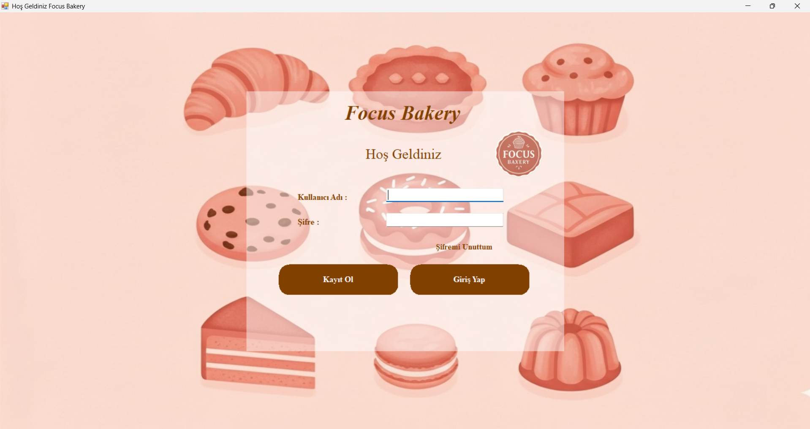
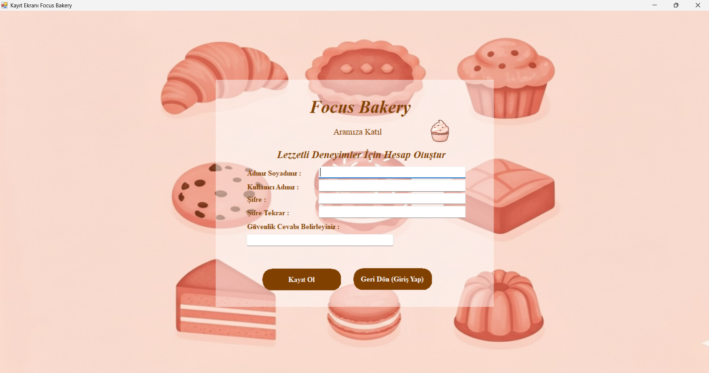
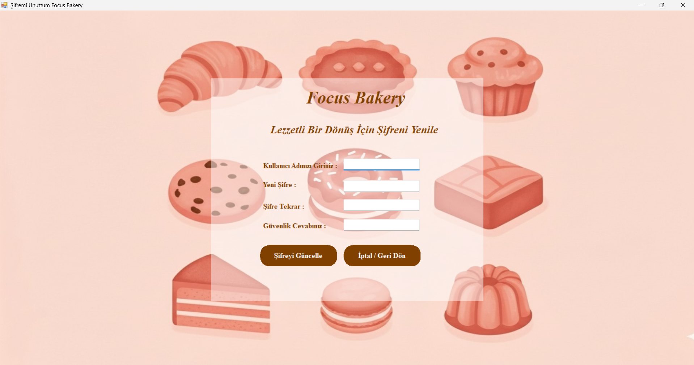
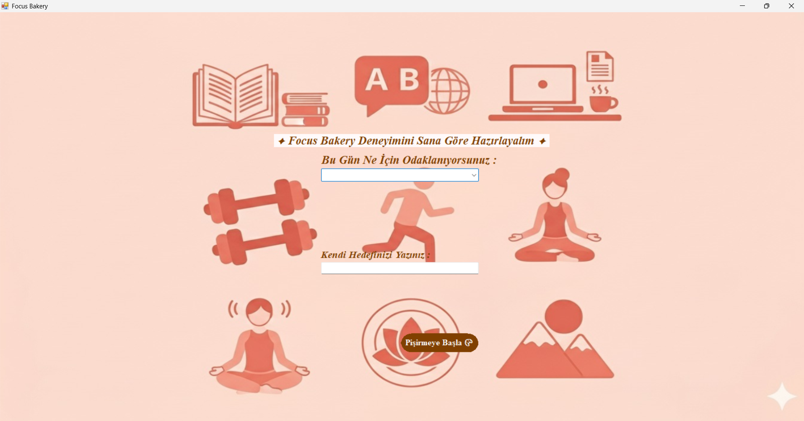
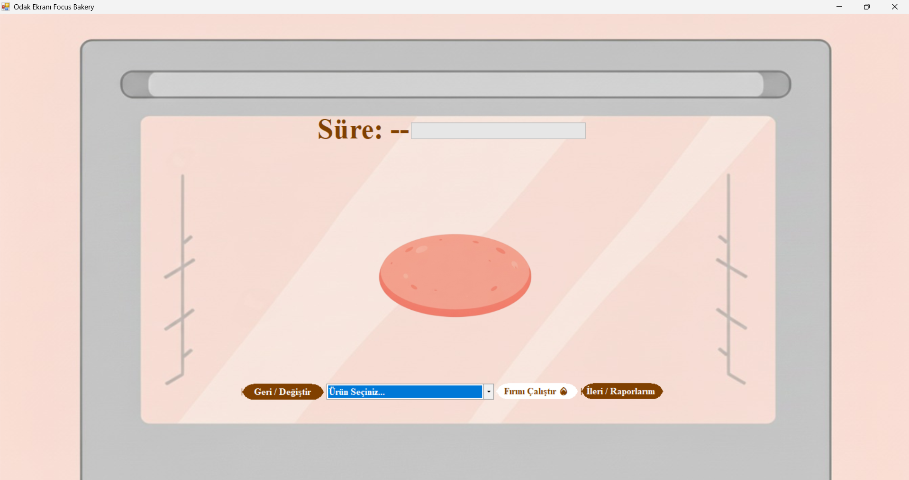
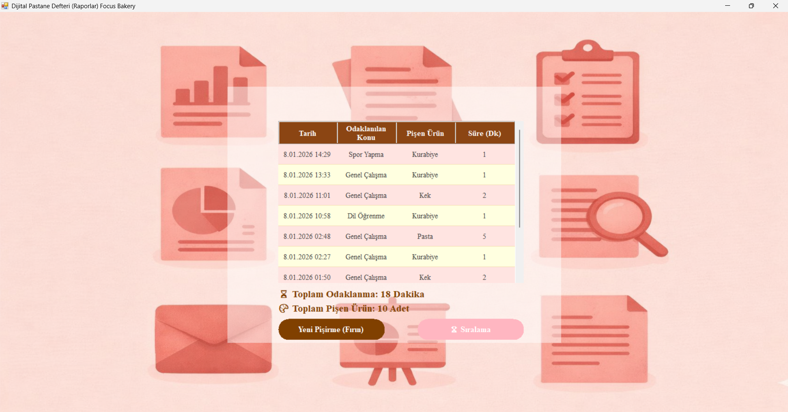
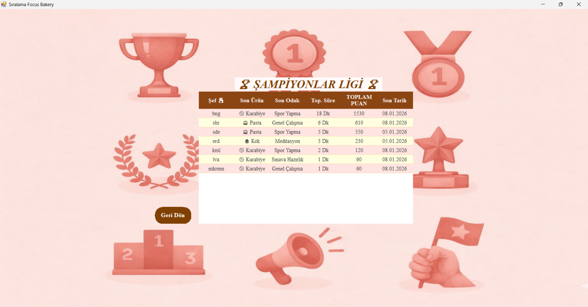

# 🥐 Focus Bakery | Gamified Productivity Tool (WinForms)

**Focus Bakery**, Pomodoro tekniğini fırıncılık konseptiyle harmanlayan, kullanıcıların odaklanma sürelerini artırmak ve çalışma alışkanlıklarını oyunlaştırmak için tasarlanmış kapsamlı bir masaüstü uygulamasıdır.

## 🎯 Projenin Amacı
Kullanıcıların çalışma seanslarını (ekmek pişirme seansları) yöneterek, verimliliklerini artırmak ve bu verileri SQL tabanlı bir sistemde raporlayarak gelişimlerini takip etmelerini sağlamaktır.

## 🚀 Teknik Özellikler & Modüller

### 1. Kullanıcı Yönetimi & Güvenlik (Form 6 & 7 Güncellemeleri)
* **Gelişmiş Kayıt Paneli:** Kullanıcı bilgilerinin doğrulanarak veritabanına kaydedilmesi.
* **Güvenli Giriş:** Session yönetimi ile kullanıcıya özel çalışma alanı.
* **Şifre Kurtarma:** SQL sorguları ile entegre çalışan güvenlik katmanı.

### 2. Odaklanma Motoru (Pomodoro Logic)
* **Dinamik Sayaç:** Kullanıcının seçtiği ürüne (Ekmek, Kruvasan vb.) göre değişen pişme süreleri.
* **Durum Bildirimleri:** Ürün piştiğinde kullanıcıyı uyaran görsel ve işlevsel geri bildirimler.

### 3. Veritabanı Mimarisi (SQL Server)
* **İlişkisel Veritabanı:** Kullanıcılar ve Odaklanma Geçmişi tabloları arasında kurulan ilişki.
* **T-SQL Sorguları:** Verilerin kaydedilmesi, güncellenmesi ve kullanıcı bazlı raporlanması için optimize edilmiş sorgular.
* **Veri Kalıcılığı:** Uygulama kapansa dahi tüm ilerlemenin SQL Server üzerinde saklanması.

## 🛠 Kullanılan Teknolojiler
* **Dil:** C# (C-Sharp)
* **Framework:** .NET Framework 4.8 / WinForms
* **Veritabanı:** Microsoft SQL Server
* **Veri Erişim:** ADO.NET & Entity Framework Framework Yaklaşımları
* **Tasarım:** Modern UI/UX Prensipleri ve Custom Component Kullanımı

## 📁 Proje Yapısı
* `Models/`: Veritabanı tablolarını temsil eden sınıflar.
* `Forms/`: Kullanıcı arayüzü ve formlar arası geçiş mantığı.
* `Data/`: SQL bağlantı dizesi ve veritabanı CRUD işlemleri.

## 📸 Uygulama Görselleri
> ## 📸 Uygulama Arayüzü (7 Ana Modül)

  
  
  

  
  
  

  

## ⚙️ Kurulum Talimatları
1. Projeyi bilgisayarınıza indirin (Clone).
2. `App.config` içerisindeki `connectionString` alanını kendi SQL Server adresinize göre düzenleyin.
3. Proje içerisinde bulunan `.sql` scriptini çalıştırarak veritabanı tablolarını oluşturun.
4. Visual Studio üzerinden `Build` ederek uygulamayı başlatın.
